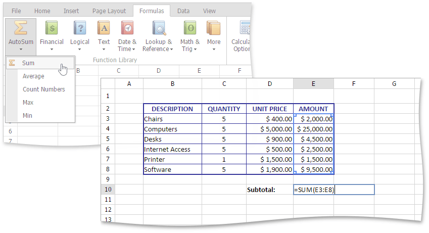

The **Spreadsheet** provides the capability to use a set of predefined **functions** in formulas to perform simple or complex calculations.

To create a formula containing functions, follow the instructions below.
1. Click the cell in which you want to insert the formula.
2. Type the equal sign "=". This is required to interpret the cell content as a formula. Skip this action if you insert the function in a cell which already contains a formula.
3. Type the function's name, or [insert the required function](#insertfunction) from the **Function Library**.
4. Enter the arguments between the function's parentheses.
5. Press **ENTER**. The result appears in the cell in which you inserted the formula.

## <a name="insertfunction"/>Insert a Function
If you do not remember the name of the function you want to use, you can insert the desired function quickly using the **Function Library** group within the **Formulas** tab.

On the **Formulas** tab, in the **Function Library** group, click the button corresponding to the category to which your function belongs, and select this function from the button's drop-down list.

> Frequently used functions such as **Sum**, **Average**, **Count Numbers**, **Max** and **Min** are also listed under the **AutoSum** button on the **Home** tab in the **Editing** group.

For example, if you wish to add all numbers in the range **E4:E8**, in the **Function Library** group, select the **SUM** function from the **AutoSum** (or **Math &amp; Trig**) button's drop-down list. Type "E4:E8" in the function's parentheses or select the cell range directly in the worksheet, and press **ENTER**.

> If you start the formula with a function, the **Spreadsheet** automatically adds the equal sign to your formula.

## <a name="nestedfunction"/>Nested functions
You can create a formula with a function that uses another function as one of the arguments. A function that is used as an argument is called a **nested function**. A formula can contain up to 64 levels of nesting.

Examples of formulas with nested functions are detailed in the table below.

| Formula | Description |
|---|---|
| **=ROUND(SUM(A1:A5),2)** | Round the sum of the values contained in the cell range **A1:A5** to two decimal places. |
| **=SQRT(AVERAGE(A1:A5))** | Returns the square root of the average value of the numbers in the cell range **A1:A5**. |
| **=IF(A5&LT;1000, POWER(A5,2))** | Square the value in cell **A5** if it is less than 1000. |